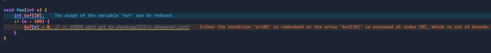
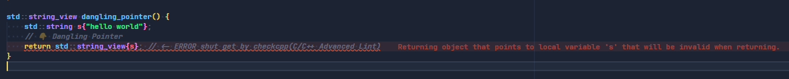

# VSCppEase: Out-of-the-Box C/C++ Development Environment for VS Code

## Project Overview
VSCppEase aims to provide a simple, comprehensive C/C++ development environment for VS Code. By offering pre-configured profile files, users can avoid the hassle of manually installing extensions or adjusting complex settings. Simply download, import, and start developing immediately.

- **One-Click Setup**: Provides ready-to-use VS Code configuration files, including extensions, settings, and keybindings. No longer need to manually install each extension or debug their environment—just import the profile and start coding.

- **Efficiency**: Compilation, debugging, error checking, static analysis, testing, and package management are all streamlined.

## Table of Contents
  - [Installation](#installation)
  - [Examples and Tutorials](#examples-and-tutorials)
    - [Compilation \& Debugging](#compilation--debugging)
      - [Compilation](#compilation)
      - [Debugging Code](#debugging-code)
      - [Debugging CMakeLists.txt](#debugging-cmakeliststxt)
    - [Error Checking and Linting](#error-checking-and-linting)
  - [Testing](#testing)
  - [Package Management](#package-management)
  - [Others extensions](#others-extensions)
    - [Cpp Reference](#cpp-reference)
  - [Contribute](#contribute)

## Installation

1. **Download Profile Files**
   - Obtain the `.code-profile` from the [profiles folder](./profiles) in the project repository.

    > Certain plugins require additional utility software. Refer to `Software Dependencies` in the [Error Checking and Linting](#error-checking-and-linting) section for more details.

2. **Import Profile**
   - In VS Code, navigate to `Settings icon > profile > profiles > New Profile> Import Profile...`, select the downloaded profile, and import it.
   > Avoid directly importing the `base.code-profile` `settings`, that could override global configurations. Refer to [base_settings.jsonc](./profiles/base_settings.jsonc) for details.

When you are done switching profiles, you can `ctrl + ,` to see the preset settings, (recommended to view via json formation)

## Examples and Tutorials

1. The following content is based on the [gRPC_example](./projects/gRPC_example) project sample and the `C-CPP BackEnd.code-profile` extensions and settings.
2. To build the `gRPC_example`, refer to the [gRPC_example README.md](./projects/gRPC_example/README.md).

The `C-CPP BackEnd` profile includes over 50 extensions (such as Copilot and YAML support), but here we’ll focus on core features like debugging, testing, and package management.

Most features are pre-configured (accessible via `Ctrl + ,` to view settings). Additional configurations examples can be found in [gRPC_example's .vscode folder](./projects/gRPC_example/.vscode).

### Compilation & Debugging

#### Compilation

The [CMake Tools](https://marketplace.visualstudio.com/items?itemName=ms-vscode.cmake-tools) extension is used for a Clion-like experience. By writing a [CMakePresets.json](./projects/gRPC_example/CMakePresets.json) file and selecting your configurations from the CMake toolbar, you can quickly compile your project.

- [VS Code CMake Video Tutorial](https://www.youtube.com/watch?v=Xuucb2k6kI4)
- [CMake Presets Documentation](https://cmake.org/cmake/help/latest/manual/cmake-presets.7.html)

#### Debugging Code

[CMake Tools](https://marketplace.visualstudio.com/items?itemName=ms-vscode.cmake-tools) supports debugging via the left or bottom toolbar debug buttons. It relies on the [C/C++](https://marketplace.visualstudio.com/items?itemName=ms-vscode.cpptools) extension.

> It is recommended to set `${command:cmake.launchTargetPath}` in `.vscode/launch.json` to allow debugging previously selected CMake binaries with the F5 shortcut for greater flexibility. Refer to the [launch.json file](./projects/gRPC_example/.vscode/launch.json) for details.

#### Debugging CMakeLists.txt

CMake Tools also supports debugging CMake itself. This feature is particularly useful for complex CMake configurations and variables.

Extensions Required for Debugging

- [CMake Tools](https://marketplace.visualstudio.com/items?itemName=ms-vscode.cmake-tools)
- [C/C++](https://marketplace.visualstudio.com/items?itemName=ms-vscode.cpptools)
- [CodeLLDB](https://marketplace.visualstudio.com/items?itemName=vadimcn.vscode-lldb)
- [CMake Language Support](https://marketplace.visualstudio.com/items?itemName=josetr.cmake-language-support-vscode)

> Full CMake Presets support requires CMake version 3.23 or above.

### Error Checking and Linting

Error and standard compliance prompts rely on third-party tools.

Related Configuration:

- [C/C++ Extension clang-tidy Setup Video](https://www.youtube.com/watch?v=8RSxQ8sluG0&t)
- [C/C++ Extension clang-tidy Blog](https://devblogs.microsoft.com/cppblog/visual-studio-code-c-december-2021-update-clang-tidy/)
- [clangd Configuration Docs](https://clangd.llvm.org/config)

> Note: In some cases, the `C/C++` and `clangd` extensions may not find the include paths, causing errors or auto-completion failures. You can manually configure these extensions, but it can be tedious. Since `cmake` supports generating `compile_commands.json` info, you can let the [LSP](https://microsoft.github.io/language-server-protocol/) extensions automatically identify dependencies. For [details](https://cmake.org/cmake/help/latest/variable/CMAKE_EXPORT_COMPILE_COMMANDS.html), refer to [this CMakeLists.txt](./projects/gRPC_example/CMakeLists.txt) and [c_cpp_properties.json](./projects/gRPC_example/.vscode/c_cpp_properties.json). (No extra setup is needed for clangd it automatically looks for this file in the project root.)

Extensions Required for Code Analysis

- [C/C++](https://marketplace.visualstudio.com/items?itemName=ms-vscode.cpptools)
- [clangd](https://marketplace.visualstudio.com/items?itemName=llvm-vs-code-extensions.vscode-clangd)
- [C/C++ Advanced Lint](https://marketplace.visualstudio.com/items?itemName=jbenden.c-cpp-flylint)

Software Dependencies

- clang, clangd, clang-tidy, and llvm-related software
- [cppcheck](http://cppcheck.net/)

#### Installation on Windows

1. If you’ve installed Visual Studio’s C++ components, LLVM-related software is likely pre-installed at `C:\Program Files\Microsoft Visual Studio\2022\Community\VC\Tools\Llvm\x64\bin\`. You can add it to your PATH or start VS Code from the `Developer PowerShell`in terminal.

2. Install via `scoop install llvm cppcheck`.

> Recommended Tool: [UnigetUI](https://github.com/marticliment/UnigetUI), a GUI for Windows package managers like scoop, chocolatey, winget, and cargo.

#### Installation on Linux

- Ubuntu:
  - Install via `sudo apt install -y clang clang-tidy` ([More Info](https://apt.llvm.org/))
  - Install via `sudo apt install cppcheck`.

### Testing

`CMake Tools` supports CTest and automatically recompiles changed test code. For finer control, use the `C++ TestMate` extension, which supports Google Test and Catch2.

Extensions Required for Testing

- [CMake Tools](https://marketplace.visualstudio.com/items?itemName=ms-vscode.cmake-tools)
- [C++ TestMate](https://marketplace.visualstudio.com/items?itemName=matepek.vscode-catch2-test-adapter)

### Package Management

Conan

#### Dependency Display

#### Quickly Configure Conan Environment

[Details](https://docs.conan.io/2.9/tutorial/consuming_packages/different_configurations.html#modifying-options-linking-the-application-dependencies-as-shared-libraries)

Extension Used: [VSConan](https://marketplace.visualstudio.com/items?itemName=afri-bit.vsconan)

> Remember to configure the Conan path in settings!

vcpkg

#### Dependency Display

Extension Used: [Vcpkg CMake Tools](https://marketplace.visualstudio.com/items?itemName=JackBoosY.vcpkg-cmake-tools)

## Others extensions

### [Cpp Reference](https://marketplace.visualstudio.com/items?itemName=Guyutongxue.cpp-reference)

### [C/C++ Config](https://marketplace.visualstudio.com/items?itemName=franneck94.vscode-c-cpp-config)

## Contribute

We welcome and appreciate your contributions to the project. If you have developed a useful profile or have suggestions for improvements, please consider sharing them with us. Your contributions can greatly benefit others by enhancing their development experience.

Thank you for your support!
